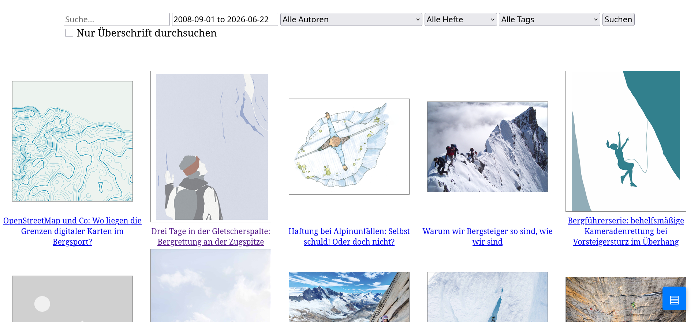
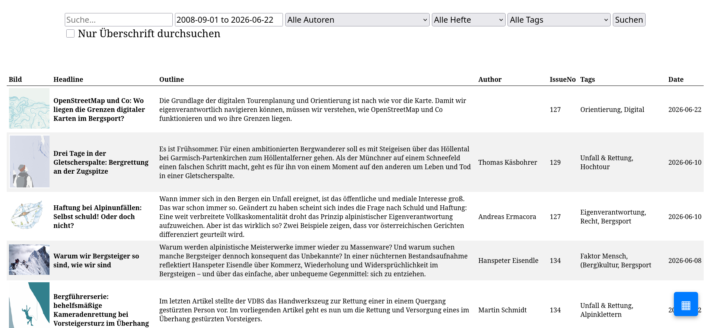
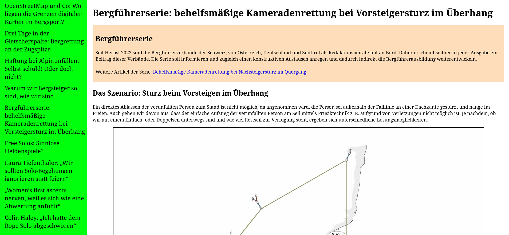

# Bergundsteigen Reader
This tool scrapes all articles from the website of the mountaineering magazine Bergundsteigen. It also implements fast search and filters. I created this tool, because they have a very weird scrolling on their website, which becomes very odd when searching for something using the browsers search tool.
## Showcase
There are two different article overview layouts, grid and list. On the top you have filtering options independent of the layout.
### Grid

### List
In the list layout you can sort after the columns by clicking on the cells in the first row.

### article view



## Setup
Copy all files to the directory where you want the reader and change the admin and user pw as well as the DB credentials in ```config.php```. Create a daily cronjob for ```update.php```.
## AI Declaration
AI inline suggestions were used in this Project, also AI was used for researching and understanding concepts.
## Technical description
### Basic Structure
```text
repo/
├── README.md               # readme
├── admin.php               # admin panel
├── article.php             # endpoint for retrieving articles
├── articles.php            # tabular view of Articles in DB
├── config.php              # config options
├── fetcher.php             # contains Functions for fetching and parsing upstream articles from bergundsteigen
├── main.js                 # js function defs
├── reader.php              # contains reader for articles
├── style.css               # css
├── update.php              # php script for cron job
├── viewer.php              # contains PHP functions for fetching articles from local DB
```
The program gets the latest articles from bergundsteigen and compares to the database until it finds a missing article. Then it downloads all newer articles.

For downloading articles it downloads the page, finds the main content div. Then it reencodes the article step by step. It assigns an id to every image and puts a reference in the code and then downloads all the images to a folder.

All data except for the Images, which are stored on the disk, is stored in a MySQL-Database. Nearly filtering is done using simple MySQL-Queries and therefor very fast.

When loading an article the DB is queried and the image references are replaced by URLs or(todo) base64 encoded images.
### Image locations
The images src fields are referenced in the saved HTML with img-n-src e.g img-1-src. They're saved in Folders named after the articles headline, but with Spaces replaced with underscores and illegal(UNIX) Characters(\0 and /) removed.
### DB-Scheme
#### article table
| id                              | Hash    | Headline     | Outline | Content      | Author       | Tags         | IssueNo          | Date |
|---------------------------------|---------|--------------|---------|--------------|--------------|--------------|------------------|------|
| INT                             | BIN(64) | VARCHAR(512) | TEXT    | MEDIUMTEXT   | VARCHAR(255) | VARCHAR(512) | SMALLINT         | DATE |
| AUTO_INCREMENT <br> PRIMARY KEY |         |              |         |              | FOREIGN KEY  |              |                  |      |
|                                 |         |              |         | saved as HTML|              | saved as csv | -1 if online only|      |
#### authors table
| author       | bio  | ArticleCount | image           |
|--------------|------|--------------|-----------------|
| VARCHAR(255) | TEXT | INT          | MEDIUMBLOB      |
| PRIMARY KEY  |      | DEFAULT 0    |                 |
|              |      |              | just image data |

### session ids table
just contains active sessions
| sessionId   | admin |
|-------------|-------|
| VARCHAR(32) | BOOL  |
| PRIMARY KEY |       |